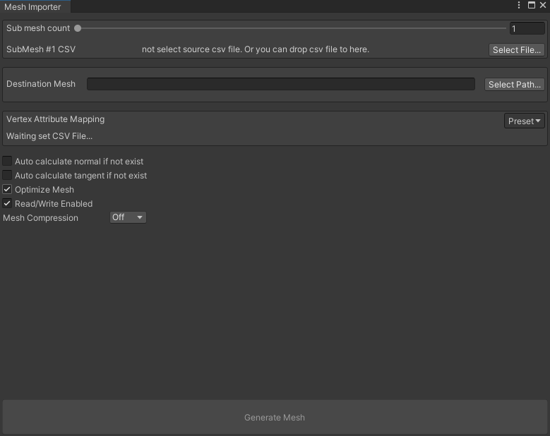

# RenderDocForUnityPlugins
Some useful tools for RenderDoc

## Requirement

Unity 2020.3.6f1

RenderDoc 1.13

## CSV Mesh Importer

### How to use

First export the CSV file containing the Mesh information from RenderDoc.
Then run the menu command "RenderDocPlugins/Import Mesh From CSV" to open the editing window, follow the contents of the window to set up, and press the "Generate Mesh" button.

### Support Vertex Attribute

- Position
- Normal
- Tangent
- TexCoord0
- TexCoord1
- TexCoord2
- TexCoord3
- TexCoord4
- TexCoord5
- TexCoord6
- TexCoord7

### Screenshot

